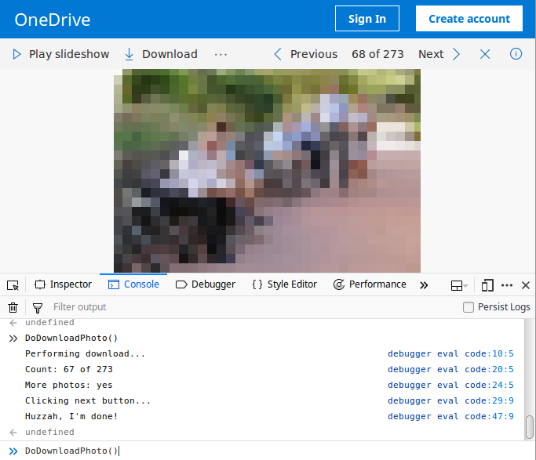

# What?

Use the JavaScript function to download photos from OneDrive semi-automatically.

# Why?

I had issues with the download of a public photo album with large photos from a DSLR. It aborted or forwarded me to a login page even though the album was public and had a `Download` button.

# Usage

* Open Mozilla Firefox webbrowser
* Set the default download directory to your destination directory
* Navigate to the OneDrive URL
* Open the JavaScript file `DownloadOneDrive.js` in a text editor and copy its content
* Open the Web Console (Ctrl+Shift+K)
* Paste the content of the JavaScript file from the clipboard into the console and submit the content
* Type `DoDownloadPhoto()` into the console and submit it, this should trigger the download of the first photo
* Press the arrow up key to see the function call `DoDownloadPhoto()` in the command lin eagain, submit it to download the next photo
* Repeat the last step until all photos are downloaded

# Screenshot (demo)

